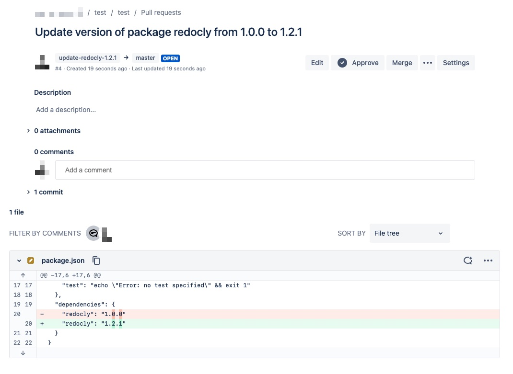

# Bitbucket Update Package Version

This script is used to update the version of a package in a Bitbucket repository. The script will create a new branch, commit the updated package version in `package.json`, and create a pull request for the changes.

## COMMENTS

- this script does not check the current version of the package, so it can also be used to downgrade the package's version if desired
- the script will throw an error if the specified package does not exist in the `package.json` file, however this behavior can be removed if desired to allow the script to create new dependencies. This script can be easily modified to support multiple `package.json files` (e.g. for a monorepo) by allowing the user to specify multiple files and optionally creating a separate pull request for each file.
- Error Handling: this script should have better error handling with clear error messages (one laners), especially when is used in CI/CD
- UI: it's possible to use `Inquirer.js` to provide support for command line interface - it will allow to run this via npx without typing a long command
- CI/CD: some of automation processes has access to COMMIT HASH, TOKEN, BRANCH NAME or already have an access to repository, it's possible to detect environment and use `git` commands instead of Bitbucket API
- Logging: create some logs?
- We can check how other libraries handle this process
  - [npm-check-updates](https://github.com/raineorshine/npm-check-updates) upgrades your package.json dependencies to the latest versions, ignoring specified versions. 

## Requirements

- Node.js
- Bitbucket API credentials (username and password or token)

## Usage

To use the script, run the following command:

    node update-package.js --packageName <packageName> --version <new-version> --workspace <workspace-name> --repoSlug <repository-name> [--branch <branch-name> --author <author-name> --packageJsonPath <path-to-package-json>]

The script accepts the following parameters:

- `packageName`: the name of the npm package to update
- `version`: the version of the npm package to update to
- `workspace`: the Bitbucket workspace that contains the repository
- `repoSlug`: the slug of the Bitbucket repository
- `branch` (optional): the branch to update. Defaults to `"master"`.
- `author` (optional): the author of the commit and pull request. Defaults to `"Update Script <noreply@redocly.com>"`.
- `packageJsonPath` (optional): the path to the `package.json` file in the repository (defaults to `"package.json"`)

## Environment variables

The script requires the following environment variables to be set:

- `USERNAME`: the username of the user authenticating with the BitBucket API.
- `PASSWORD`: the password of the user authenticating with the BitBucket API.

Alternatively, the `TOKEN` environment variable can be set with a personal access token for authentication.

## Example

To update the version of the lodash package to 4.17.15 in the my-workspace workspace, my-repo repository, on the development branch, with the John Doe <john.doe@example.com> as the author, run the following command:

    USERNAME=john.doe PASSWORD=my-password node update-package.js --packageName lodash --version 4.17.15 --workspace my-workspace --repoSlug my-repo --branch development --author "John Doe <john.doe@example.com>" --packageJsonPath=package.json

### Output

The script will output a message indicating the pull request number and URL, for example:

    Pull request #42 Update version of package lodash from 4.17.14 to 4.17.15 created
    Check out: https://bitbucket.org/my-workspace/my-repo/pull-requests/42

## Notes

- The script authenticates to the Bitbucket API using the provided username and password, alternatively token. You may need to create an app password for the script to use. Please check instructions here: <https://support.atlassian.com/bitbucket-cloud/docs/create-an-app-password/>
- You need to create credentials with permissions below:
  - `repository:read` - to read `package.json` file
  - `repository:write` - to update `package.json` file
  - `pullrequest:write` - to create pull request
- The script assumes that the `package.json` file uses the correct formatting and structure. It will use the `prettier-package-json` package to format the file after updating the version.
- The script will create a new branch for the changes, using the pattern `update-<packageName>-<version>`. It will commit the changes to this branch and create a pull request for the changes.
- The script will throw an error if any of the required parameters are not provided or are invalid. It will also throw an error if it cannot retrieve the last commit information or if the specified package is not found in the `package.json` file.

## Development

Install requirements `npm install`

## Tests

Running tests `npm tests`

## Build

TBD

## Changelog 

### v0.0.2 Logs support:

- added logs
